# Architecture Prompt2Prod

## Guide DevOps et Documentation Technique

**Version:** 1.0  
**Date:** Septembre 2025  
**Auteur:** Équipe DevOps

---

## Table des Matières

1. [Vue d'ensemble](#vue-densemble)
2. [Arborescence du projet](#arborescence-du-projet)
3. [Architecture technique](#architecture-technique)
4. [Stack technologique](#stack-technologique)
5. [Pipeline DevOps](#pipeline-devops)
6. [Configuration de l'environnement](#configuration-de-lenvironnement)
7. [Déploiement](#déploiement)
8. [Monitoring et observabilité](#monitoring-et-observabilité)
9. [Bonnes pratiques](#bonnes-pratiques)

---

## Vue d'ensemble

Le **Prompt2Prod** démontre une pipeline DevOps complet permettant de transformer une idée exprimée en langage naturel en un projet GitHub déployé et prêt pour la production.

### Objectif métier

- **Input:** Prompt utilisateur (ex: "Create a Node.js REST API for a todo app")
- **Output:** Repository GitHub complet avec code, CI/CD, tests, et déploiement

### Valeur ajoutée DevOps

- Démonstration de l'automatisation complète de la chaîne de valeur
- Intégration d'outils modernes (KGateway CNCF, Ollama, FastAPI)
- Patterns cloud-native avec Kubernetes
- GitOps et Infrastructure as Code

---

## Arborescence du projet

```
poc-openhands/
├── .github/
│   └── workflows/
│       └── deploy.yml              # Pipeline CI/CD GitHub Actions
├── docker/
│   └── Dockerfile                  # Multi-stage build optimisé
├── docs/                          # Documentation (ce document)
│   ├── architecture/
│   ├── api/
│   ├── functional/
│   └── assets/
├── k8s/
│   └── base/                      # Manifests Kubernetes
│       ├── app-deployment.yaml    # Déploiement application principale
│       └── (autres déploiements K8s)
├── scripts/                       # Scripts d'automatisation DevOps
│   ├── setup-k3s.sh             # Installation cluster K3s
│   ├── setup-kgateway.sh        # Configuration KGateway (CNCF)
│   ├── setup-ollama-models.sh   # Chargement modèles AI locaux
│   ├── deploy.sh                 # Script de déploiement complet
│   └── test.sh                   # Tests d'intégration
├── src/
│   └── api/
│       └── main.py               # API FastAPI principale
├── tests/                        # Suite de tests automatisés
│   ├── unit/
│   └── integration/
├── requirements.txt              # Dependencies Python
├── requirements-test.txt         # Dependencies pour tests
├── CLAUDE.md                     # Instructions pour Claude Code
└── README.md                     # Documentation utilisateur
```

### Rôles des composants clés

- **`.github/workflows/`**: Pipeline CI/CD avec build, test, et déploiement automatisé
- **`docker/`**: Containerisation avec optimisations production
- **`k8s/base/`**: Déploiements cloud-native avec probes de santé
- **`scripts/`**: Automatisation DevOps pour setup et maintenance
- **`src/api/`**: Logique métier de l'API de génération de projets

---

## Architecture technique

### Architecture globale

```mermaid
graph TB
    subgraph "Utilisateur"
        User[👤 Utilisateur]
    end

    subgraph "GitHub Ecosystem"
        GH[📱 GitHub Repository]
        GA[⚡ GitHub Actions]
        GHCR[📦 GitHub Container Registry]
    end

    subgraph "Cluster Kubernetes"
        subgraph "Ingress Layer"
            KGW[🌐 KGateway<br/>CNCF Gateway API]
        end

        subgraph "Application Layer"
            APP[🚀 FastAPI Application]
        end

        subgraph "AI Services"
            OLLAMA[🤖 Ollama<br/>Local LLM]
            OPENROUTER[☁️ OpenRouter<br/>Cloud LLM]
        end
    end

    User -->|Push Code| GH
    GH -->|Trigger| GA
    GA -->|Build & Push| GHCR
    GA -->|Deploy| KGW

    KGW -->|Route by header| APP
    APP -->|Local mode| OLLAMA
    APP -->|Cloud mode| OPENROUTER
```



### Flux de données

1. **Développement**: Code pushed → GitHub Repository
2. **CI/CD**: GitHub Actions → Build image → Push GHCR
3. **Déploiement**: Actions → Deploy to K8s → Update deployments
4. **Runtime**: User request → FastAPI → Ollama local → Generated text
5. **Response**: Generated code → User

**Note importante :** Contrairement au nom "poc-openhands", cette implémentation N'utilise PAS OpenHands. Il s'agit d'une architecture directe FastAPI → Ollama pour la génération de code.

### Composants techniques détaillés

#### 1. KGateway (CNCF Gateway API)

- **Rôle**: Routage intelligent des requêtes LLM
- **Technologie**: CNCF Gateway API (pas Ingress legacy)
- **Routing**: Header `x-llm-mode: local|cloud`
- **Load balancing**: Entre services Ollama/OpenRouter

#### 2. FastAPI Application

- **Framework**: FastAPI avec validation Pydantic
- **Endpoints**: `/generate`, `/health`, `/models`, `/docs`
- **Architecture**: Async/await pour performance
- **Observabilité**: Health checks et métriques

#### 3. Services AI

- **Ollama**: LLM local uniquement (Llama3.2, Mistral, etc.)
- **Mode local**: Direct vers Ollama, gratuit et privé
- **Mode cloud**: Routage KGateway (architecture de démonstration non implémentée)

---

## Stack technologique

### Containerisation et orchestration

- **Docker**: Multi-stage builds pour optimisation
- **Kubernetes**: K3s pour environnement léger
- **Container Registry**: GitHub Container Registry (GHCR)

### CI/CD et GitOps

- **GitHub Actions**: Pipeline déclaratif avec parallélisation
- **Secrets Management**: GitHub Secrets pour credentials
- **Deployment**: GitOps avec kubectl et Kustomize

### Monitoring et observabilité

- **Health Checks**: Liveness et readiness probes
- **Logs**: Centralisés via kubectl logs
- **Metrics**: Endpoints `/health` et `/metrics`

### Développement et tests

- **Language**: Python 3.11 avec FastAPI
- **Testing**: pytest avec couverture de code
- **Linting**: ruff pour qualité de code
- **Documentation**: Swagger/OpenAPI automatique

---

## Pipeline DevOps

### GitHub Actions Workflow

```yaml
name: Build and Deploy

on:
  push:
    branches: [main]
  pull_request:
    branches: [main]

jobs:
  build-test-deploy:
    runs-on: ubuntu-latest
    permissions:
      contents: read
      packages: write

    steps:
      - name: Checkout repository
        uses: actions/checkout@v4

      - name: Set lowercase owner name
        run: echo "OWNER_LC=${OWNER,,}" >>${GITHUB_ENV}
        env:
          OWNER: "${{ github.repository_owner }}"

      - name: Set up Docker Buildx
        uses: docker/setup-buildx-action@v3

      - name: Log in to Container Registry
        uses: docker/login-action@v3
        with:
          registry: ghcr.io
          username: ${{ github.actor }}
          password: ${{ secrets.GITHUB_TOKEN }}

      - name: Build and push Docker image
        uses: docker/build-push-action@v5
        with:
          context: .
          file: ./docker/Dockerfile
          push: ${{ github.event_name != 'pull_request' }}
          tags: |
            ghcr.io/${{ env.OWNER_LC }}/poc-openhands:latest
            ghcr.io/${{ env.OWNER_LC }}/poc-openhands:${{ github.sha }}
          cache-from: type=gha
          cache-to: type=gha,mode=max

      - name: Run tests
        run: |
          echo "🧪 Running tests..."
          # Tests automatisés ici

      - name: Deploy to K3s
        if: github.ref == 'refs/heads/main'
        run: |
          # Déploiement automatisé
          kubectl apply -f k8s/base/
```

### Étapes du pipeline

1. **Build Phase**

   - Checkout du code source
   - Build multi-stage de l'image Docker
   - Push vers GHCR avec tags optimisés

2. **Test Phase**

   - Tests unitaires et d'intégration
   - Validation de la qualité de code
   - Vérification des vulnérabilités

3. **Deploy Phase**
   - Déploiement sur cluster K3s
   - Rolling update sans downtime
   - Vérification des health checks

---

## Configuration de l'environnement

### Prérequis système

```bash
# Outils requis
- Docker >= 20.10
- kubectl >= 1.25
- k3s ou cluster Kubernetes
- pandoc (pour génération PDF)
- Python 3.11+
```

### Installation du cluster K3s

```bash
# Installation K3s lightweight
curl -sfL https://get.k3s.io | sh -

# Configuration kubectl
sudo cp /etc/rancher/k3s/k3s.yaml ~/.kube/config
sudo chown $USER ~/.kube/config

# Vérification
kubectl get nodes
```

### Setup des services AI

```bash
# Déploiement Ollama avec modèle
kubectl apply -f k8s/base/app-deployment.yaml

# Chargement d'un modèle léger
kubectl exec deployment/ollama -- ollama pull llama3.2:1b

# Vérification
kubectl exec deployment/ollama -- ollama list
```

### Configuration KGateway (CNCF)

```bash
# Installation KGateway
./scripts/setup-kgateway.sh

# Configuration des routes
kubectl apply -f k8s/base/gateway.yaml

# Test du routing
curl -H "x-llm-mode: local" http://kgateway/v1/chat
```

---

## Déploiement

### Déploiement automatisé

```bash
# Clone du repository
git clone https://github.com/username/poc-openhands.git
cd poc-openhands

# Setup complet de l'environnement
./scripts/setup-k3s.sh
./scripts/setup-kgateway.sh
./scripts/deploy.sh

# Vérification du déploiement
kubectl get pods -A
kubectl get svc -A
```

### Déploiement manuel étape par étape

```bash
# 1. Build de l'image
docker build -t ghcr.io/username/poc-openhands:latest -f docker/Dockerfile .

# 2. Push vers registry
docker push ghcr.io/username/poc-openhands:latest

# 3. Déploiement sur K8s
kubectl apply -f k8s/base/app-deployment.yaml

# 4. Exposition du service
kubectl port-forward svc/app 8080:80
```

### Configuration des secrets

```bash
# GitHub Container Registry
kubectl create secret docker-registry ghcr-secret \
  --docker-server=ghcr.io \
  --docker-username=username \
  --docker-password=$GITHUB_TOKEN

# OpenRouter API Key (si utilisé)
kubectl create secret generic openrouter-secret \
  --from-literal=api-key=$OPENROUTER_API_KEY
```

---

## Monitoring et observabilité

### Health Checks

```python
@app.get("/health")
async def health():
    return {
        "status": "healthy",
        "timestamp": datetime.utcnow().isoformat(),
        "version": "1.0.0"
    }
```

### Kubernetes Probes

```yaml
livenessProbe:
  httpGet:
    path: /health
    port: 8000
  initialDelaySeconds: 30
  periodSeconds: 30

readinessProbe:
  httpGet:
    path: /health
    port: 8000
  initialDelaySeconds: 5
  periodSeconds: 5
```

### Surveillance opérationnelle

```bash
# Logs en temps réel
kubectl logs -f deployment/app

# Métriques de performance
kubectl top pods

# Status du cluster
kubectl get pods -o wide
```

### Métriques importantes à surveiller

- **Latence API**: Temps de réponse des endpoints
- **Taux d'erreur**: 4xx/5xx responses
- **Ressources**: CPU/Memory usage des pods
- **Disponibilité**: Uptime des services AI

---

## Bonnes pratiques

### Sécurité

- ✅ Images scannées pour vulnérabilités
- ✅ Secrets managed via Kubernetes secrets
- ✅ RBAC configuré pour accès minimal
- ✅ Network policies pour isolation

### Performance

- ✅ Multi-stage builds pour images optimisées
- ✅ Resource limits sur tous les pods
- ✅ Caching Docker layers dans CI/CD
- ✅ Async/await pour I/O non-blocking

### Fiabilité

- ✅ Health checks complets (liveness/readiness)
- ✅ Graceful shutdown avec signaux
- ✅ Rolling updates pour zero-downtime
- ✅ Backup et recovery procedures

### Maintenabilité

- ✅ Documentation technique complète
- ✅ Code commenté et structuré
- ✅ Tests automatisés à tous niveaux
- ✅ Logging structuré pour debugging

---

## Conclusion

Ce POC démontre une implémentation moderne d'une pipeline DevOps complète, intégrant:

- **Automatisation**: From code to production en un push
- **Scalabilité**: Architecture cloud-native avec Kubernetes
- **Observabilité**: Monitoring et debugging intégrés
- **Sécurité**: Bonnes pratiques de sécurité appliquées
- **Innovation**: Intégration AI avec patterns DevOps modernes

L'architecture présentée est **production-ready** et peut servir de base pour des projets d'entreprise nécessitant une automation complète de la chaîne de développement.

---

## Architecture réelle vs nom du projet

**Note historique :** Ce projet était initialement nommé "poc-openhands" mais a été renommé "Prompt2Prod" pour mieux refléter son implémentation réelle (FastAPI + Ollama).

### Ce qui est implémenté ✅
- **FastAPI** : API moderne avec documentation automatique
- **Ollama** : Inférence IA locale sans coûts externes
- **Kubernetes** : Orchestration cloud-native avec K3s
- **GitHub Actions** : Pipeline CI/CD moderne
- **KGateway** : Architecture Gateway API (CNCF)

### Ce que pourrait apporter OpenHands 💭
- **Orchestration complexe** : Workflows multi-étapes
- **Agents spécialisés** : Architecture, code, tests, documentation
- **Intégration GitHub** : Création automatique de repos
- **Validation iterative** : Amélioration automatique du code

Cette architecture démontre les patterns DevOps modernes sans la complexité d'orchestration d'OpenHands.

---

_Document généré automatiquement - Dernière mise à jour: Septembre 2025_
